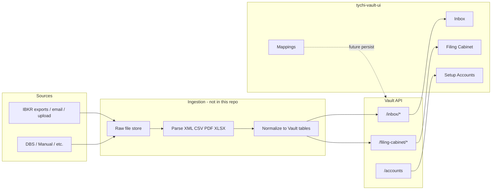

# Business Requirements Document (BRD)

## Tychi Vault UI — IBKR Integration, Data Flow, and Modules

**Document scope:** This BRD reflects the **`tychi-vault-ui`** codebase (React) and the Vault API contracts it consumes. **IBKR XML parsing is not implemented in this repository**; XML is accepted on upload and would be parsed **server-side** (or in another service).

**Default route:** `/` → `/vault/inbox`.

**API base (from code):** `http://localhost:3000/api/vault` with optional `Authorization: Bearer <jwt>` and `x-tenant-id` from `localStorage` (`jwt_token` / `accessToken`, `tenantId` / `tenant_id`).

---

## 1. Purpose and scope

| Item | Description |
|------|-------------|
| **Product** | **Tychi Vault UI** — operational UI for ingesting custodian/broker files, configuring accounts, viewing normalized positions of record, and defining field mappings to “Tychi” shapes. |
| **IBKR role** | **IBKR** is modeled as a **source system** and **inbox source**, not as a dedicated XML parser in the UI. |
| **Out of scope in this repo** | Actual XML schema handling, Flex Query execution, validation rules, and persistence of mapping presets (mappings are **client-only** today). |

---

## 2. End-to-end flow (conceptual, including IBKR)

### 2.1 IBKR XML (industry context)

Interactive Brokers typically delivers structured reports (e.g. Flex Query XML, activity/statement extracts). Parsing maps hierarchical elements/attributes into **logical record types** the UI already recognizes indirectly, e.g. `TRADE`, `POSITION`, `CASH_TRANSACTION` (shown on raw file summaries in Filing Cabinet).

The **exact** XML paths and options depend on the **Flex Query definition** or report type on the IBKR side; that configuration is **not** represented in this UI repository.

---

## 3. Logical data domains (“tables”) and mapping

The UI treats the Vault as the **source of truth** with snake_case-style fields in the **Mappings** screen, mapped to **Tychi** target columns (`src/modules/mapping/pages/mapping-integration-page.tsx`).

### 3.1 Preset mapping domains

| Preset | Vault-side fields (examples) | Tychi target fields (examples) |
|--------|------------------------------|--------------------------------|
| **Trades** | `tenant_id`, `account_id`, `security_id`, `trade_date`, `side`, `quantity`, `price`, `net_amount`, `currency`, `exchange`, `symbol`, `source`, `raw_record_id`, … | `trade_date`, `account_id`, `symbol`, `exchange`, `side`, `quantity`, `price`, `net_amount`, `currency`, `gl_status`, `source`, `raw_record_id` |
| **Positions** | `position_date`, `cost_basis`, `market_value`, `unrealised_pnl`, … | `account_id`, `symbol`, `position_date`, quantities, PnL, `currency`, `source`, `raw_record_id` |
| **Cash Txns** | `transaction_date`, `transaction_type`, `amount`, `description`, GL push flags, … | `account_id`, `transaction_date`, `transaction_type`, `amount`, `currency`, `description`, `source`, `raw_record_id` |
| **Cash Balances** | `balance_date`, `currency`, `balance`, … | `account_id`, `balance_date`, `currency`, `balance`, `source`, `raw_record_id` |
| **Prices** | `security_id`, `price_date`, `close_price`, `price_type`, … | `symbol`, `price_date`, `close_price`, `currency`, `price_type`, `source`, `raw_record_id` |
| **FX Rates** | `rate_date`, `base_currency`, `quote_currency`, `rate`, … | `rate_date`, `base_currency`, `quote_currency`, `rate`, `source` |
| **Corp Actions** | `action_type`, `ex_date`, `record_date`, `pay_date`, `details`, `status`, … | `account_id`, `symbol`, `action_type`, `ex_date`, `status`, `source`, `raw_record_id` |
| **Securities** | `security_name`, `asset_class`, `instrument_type`, `country`, `issuer_id`, … | `symbol`, `security_name`, `asset_class`, `instrument_type`, `currency`, `country`, `source` |

**Behavior:** Users link source → target fields per preset; state is **in-memory only**; UI notes that the **next step is to persist to backend**.

---

## 4. Filing Cabinet entities (API-backed)

Aligned with `src/modules/filing/types/filing.ts` and `src/modules/filing/api/filing-api.ts`.

| Entity | Role | Key API path |
|--------|------|----------------|
| **Trade** | Executed trades for display & GL status | `GET /filing-cabinet/trades`; `GET /filing-cabinet/files/{rawFileId}/trades` |
| **Position** | Holdings snapshot | `GET /filing-cabinet/positions` |
| **CashTransaction** | Cash ledger lines | `GET /filing-cabinet/cash-transactions` |
| **CashBalance** | EOD or snapshot cash | `GET /filing-cabinet/cash-balances` |
| **Price** | Security pricing | `GET /filing-cabinet/prices` |
| **FxRate** | FX pairs | `GET /filing-cabinet/fx-rates` |
| **CorporateAction** | Dividends, splits, etc. (`details` JSON) | `GET /filing-cabinet/corporate-actions` |
| **SecurityMaster** | Canonical security row | `GET /filing-cabinet/securities` |
| **SecurityBatchSummary** | Batch of securities by source + effective date | `GET /filing-cabinet/security-batches`; drill-down `GET .../security-batches/{source}/{effectiveDate}/securities` |
| **InboxRawFileSummary** | Per-file ingestion outcome | `GET /filing-cabinet/files` |
| **SecurityEquityRow** | Equity facts | `GET /filing-cabinet/security-equities` |
| **SecurityIdentifierRow** | Identifiers (ISIN/CUSIP/etc. in `details`) | `GET /filing-cabinet/security-identifiers` |
| **SecurityOptionRow** | **Options instruments** (derivatives—not UI “settings”) | `GET /filing-cabinet/security-options` |

**Traceability:** Many rows expose `rawRecordId` / `source` linking back to ingestion.

---

## 5. Account and inbox configuration

### 5.1 Vault accounts

- **Source systems:** `IBKR`, `DBS`, `MANUAL`, `FRANKFURTER`.
- **Account types:** `BROKER`, `BANK`, `CUSTODIAN`.
- **Ingestion:** `ingestionSchedule` (`DAILY_EOD`, `WEEKLY`, `MONTHLY`, `ON_DEMAND`), optional `ingestionDayOfMonth`, `emailInboxAddress`, `ingestionConfig`, `queryId`, `authToken` (Flex/API hooks—semantics depend on backend).
- **API:** `GET /accounts`, `POST /accounts`, `PUT /accounts/:id`.

### 5.2 Inbox

- **Sources:** `IBKR`, `DBS`, `Manual`.
- **Channels:** `EMAIL`, `CRON`, `UPLOAD`, `API`.
- **Statuses:** `RECEIVED`, `PROCESSING`, `PROCESSED`, `FAILED`, `PENDING_CONFIRMATION`.
- **Upload:** `POST /inbox/upload` (multipart `file` only per API comment).
- **List:** `GET /inbox/files`.
- **UI:** Accepts `.xml`, `.csv`, `.pdf`, `.xlsx`; warns on non-standard extensions but may still upload.

---

## 6. UI module BRD (screen-by-screen)

### 6.1 Shell — `DashboardLayout`

- **Routes under** `/vault/*` with sidebar navigation.
- **Nav:** Inbox, Filing Cabinet, Setup Email, Setup Accounts, Mappings; **Settings** disabled (placeholder).
- **Branding:** “Tychi Vault”, environment badge “Prod”.

### 6.2 Inbox — `/vault/inbox`

- **Goals:** Upload files; monitor pipeline status and record counts.
- **Features:** Dropzone, success/error notices, table with file name, source, channel, uploaded time, status, record count; row actions **View**, **Retry** (failed), **Review** (pending confirmation).

### 6.3 Filing Cabinet — `/vault/filing`

- **Goals:** Inspect **normalized** data after ingestion; tie back to **raw files** and **security batches**.
- **Global filters:** Date from/to, optional `accountId`, optional `securityId`; FX uses `fxBase` / `fxQuote` (uppercased).
- **Data loading:** Parallel fetch via `useFilingData`; **partial failure** surfaces as **warnings** per section.
- **Tabs:** Trades, positions, cash, balances, prices, FX, corporate actions, securities (subtabs: batches, equities, identifiers, **options**), raw/inbox files.
- **Raw file row:** `sourceSystem`, `source`, `ingestionChannel`, `status`, `recordCount`, **`recordTypes`** (e.g. TRADE / POSITION / CASH_TRANSACTION); **View** loads trades for `rawFileId`.
- **Security extensions:** Dynamic **detail** columns from `details` object keys (broker-specific fields appear if API returns them).

### 6.4 Setup Email — `/vault/email`

- **Note:** Demo/static inboxes and report examples in code; verify live API integration separately.

### 6.5 Setup Accounts — `/vault/accounts`

- **Goals:** CRUD vault accounts, set **IBKR** as source, ingestion schedule, currencies, etc.

### 6.6 Mappings — `/vault/mappings`

- **Goals:** Visual **Vault → Tychi** field mapping for eight presets.
- **Gap:** No save/load API integration yet.

---

## 7. IBKR XML parsing — not in this repo

| Topic | In repo? |
|-------|----------|
| XML DOM / SAX / Flex schema | **No** |
| Per-node mapping from IBKR XML to DB | **No** (only high-level Mapping UI presets) |
| List of Flex Query “all options” | **No** (IBKR Account Management + backend) |

**Program-level BRD:** Combine this document with **backend** design: Flex Query IDs, email routing, object storage keys, parser modules, and exact XML elements your jobs emit.

---

## 8. Non-functional / integration

- **Auth:** JWT + tenant header from `localStorage`.
- **Resilience:** Filing hook uses `Promise.allSettled` so one failing endpoint does not block others; warnings indicate which domain failed.
- **Pagination:** Server `limit`/`offset`; client paginates some lists locally (e.g. page size 10).

---

## 9. Summary

- **Tychi Vault UI** is the **control and observability layer** over normalized broker/custodian data, with **IBKR** as one **source system** and inbox source.
- **“Options”** in the filing UI means **option instruments** (derivatives), not IBKR Flex configuration checkboxes.
- **IBKR XML parsing flow with every Flex option** is not defined in this repository; it belongs to **IBKR’s Flex configuration** and your **ingestion service**. This BRD reflects **implemented** UI modules, **API surface**, **entity model**, and **mapping presets** in code.

---

## 10. Source references (repository)

| Area | Primary paths |
|------|----------------|
| Router | `src/app/router.tsx` |
| Layout / nav | `src/layouts/dashboard-layout.tsx` |
| API client | `src/lib/api/client.ts` |
| Inbox | `src/modules/inbox/` |
| Accounts | `src/modules/accounts/` |
| Filing | `src/modules/filing/` |
| Mappings | `src/modules/mapping/pages/mapping-integration-page.tsx` |
| Email setup | `src/modules/email/pages/setup-email-page.tsx` |
